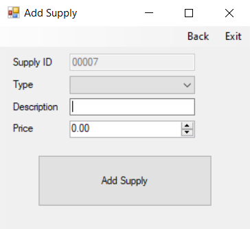
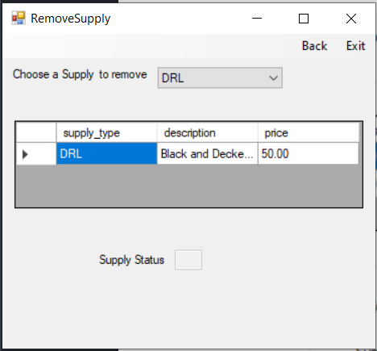

# WindowsToolHireSystem

Tool hire system that uses SQL Server as a backend.
Screenshots of Application below.
<h2>Login</h2>

<h2>Supplies</h2>

<h2>Customers Accounts</h2>

<h2>Rentals</h2>

<h2>Analysis</h2>

